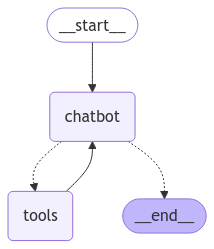

# Chat with My SportWise DataSpace on Rolling Wave

## Try the App:
[Rolling Wave Chatbot](https://m2m-rolling-wave.streamlit.app/)
(Get the login details from the repo owner)

This repository serves as a demo for Rolling Wave, showcasing an interactive chatbot application. The goal of this project is to enable users to interact with Rolling Wave's customized dataset from SportWise DataSpace seamlessly—as easily as having a conversation—while prioritizing user experience.

---

## Key Features

### **Graph-Based AI Agent**
At the heart of the chatbot is a modular graph-based agent built with LangGraph.
- **Nodes** represent specific tasks or tools.
- **Edges** define task flows, making the agent adaptable and extensible for various workflows.

    
### **Seamless Data Integration**
- Automatically loads CSV files from a folder and initializes an SQLite database.
- Designed to work out-of-the-box with both file-based and database-based architectures.
- **SQL-based querying** enhances safety by restricting client-side actions to prevent accidental errors.

### **SQL-Powered Functionality**
The chatbot incorporates four SQL tools:
1. **List Tables:** View all available tables.
2. **Retrieve Schemas:** Get the structure of tables.
3. **Validate Queries:** Check the correctness of SQL queries.
4. **Execute Queries:** Run SQL queries dynamically based on user input.

The agent dynamically constructs and executes workflows, ensuring flexibility without hardcoded sequences.

### **Efficient Memory Management**
- A trimming function prioritizes relevant context to maintain coherence in long conversations.
- Ensures meaningful responses while staying within token limits.

### **User-Friendly Interface**
Built with **Streamlit**, the interface is both functional and intuitive:
- **Table Overview:** Quickly view available tables on the left panel.
- **Collapsible Sections:** Group tool calls and outputs to reduce visual clutter while offering detailed insights.
- **Chat History:** Seamlessly maintains context with syntax-highlighted SQL outputs for readability.
- **Thought Process Toggle:** Show/hide LLM's thought process with a toggle to show the underlying actions.

### **Performance Monitoring with LangSmith**
- Tracks the agent’s decision-making, tool calls, and interactions.
- Provides transparency and actionable insights to refine chatbot performance over time.

---

## Quickstart with Docker

### **1. Download / Git Clone this repo.**

### **2. Create a `secrets.toml` File:**
1. Copy the contents of `2_ref/secrets_sample.toml` and fill in your OpenAI API and LangSmith API keys.
2. Create a folder named `.streamlit` in the project root directory.
3. Save the new file as `secrets.toml` inside the `.streamlit` folder.

### **3. Navigate to the Working Directory:**
```sh
cd /path_to_this_repo
```

### **4. Build and Run the Docker Container:**
```sh
docker compose up --build
```

### **5. Access the Chatbot:**
- Open your web browser and go to `http://localhost:8501`.
- Streamlit reflects code updates automatically.

---

## Creating Your Unique SportWise DataSpace
1. Use Rolling Wave’s [SportWise platform](https://sportwise.rolling-insights.com/) to build your custom dataset (DataSpace).
2. Download the dataset as a `.CSV` file.
3. Replace the existing files in the `1_data/` directory with your new dataset.
4. Re-run the above quickstart.

---

Enjoy exploring your data with ease!

